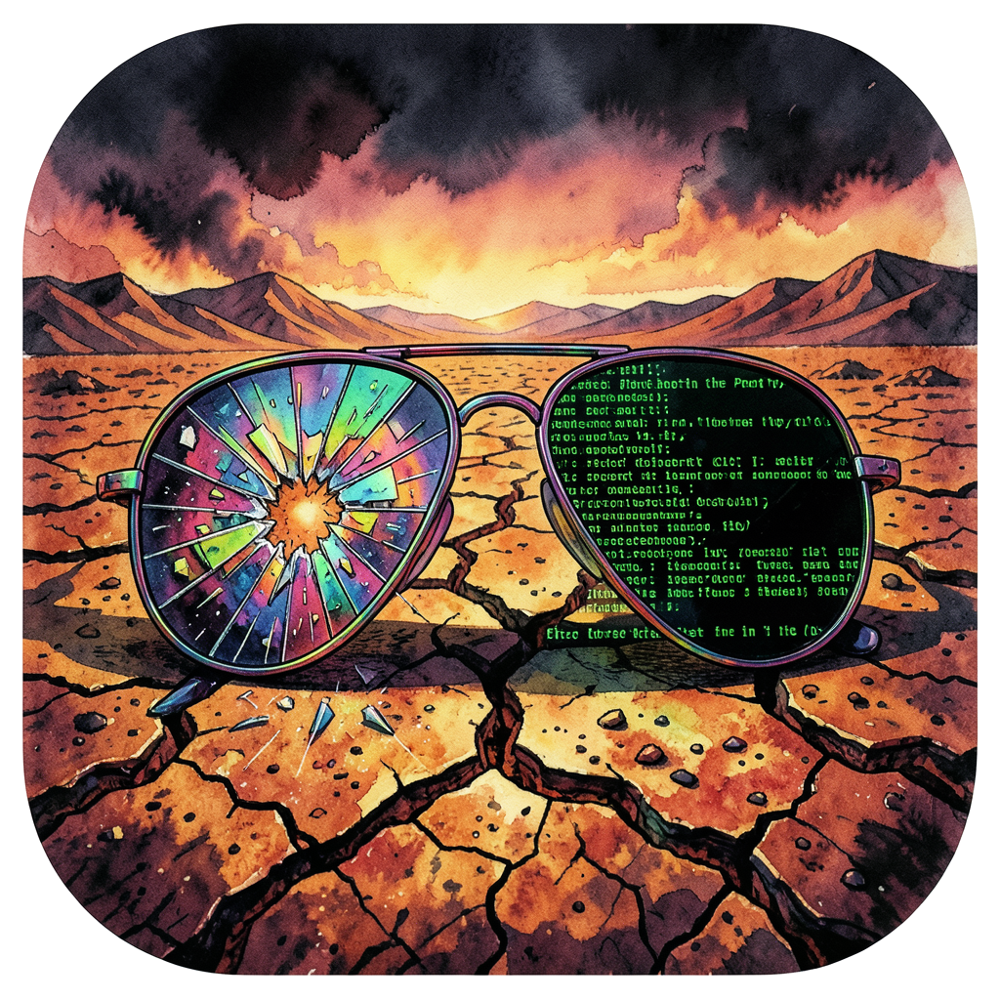

  

# Avant Garde
macOS writing tool with research-backed color psychology and professional layout engine. — v1.0

---

### A Note from the Author
I’ve been writing for 30 years—from the underground zine scene to the professional grind of Hollywood, entertainment, and the game industry. Avant Garde is a labor of love born out of impatience with invasive, locked-down editors that get in the way of the work. 

This tool is for anyone who loves the raw process of putting words on a page. It’s built to be fast, atmospheric, and lethal. We’re just getting started.

---

## The Gonzo Edge

| Feature | Description | The Advantage |
|---|---|---|
| **The Prompt Vault** | Dedicated tactical storage for series bibles and character prompts | Treat prompting as writing. Keep your world rules 1-click away |
| **Matte Paint Themes** | From *Meridian* cream to the aggressive *Desert Heat* (HST) and *The City* (Transmet) | Visual immersion that triggers your specific writing flow |
| **AI Lab (Alpha)** | Secure personal hooks for **Claude, Gemini, GPT-4, and Grok** | Your own API keys, your own data. No subscriptions. Pure power |
| **Universal Imports** | Native support for **.docx, .md, and .rtf** | Seamlessly bridge your Google Drive/Word workflow into the engine |
| **Vellum-Grade Layout** | Live editor preview with professional "Sink" headers and Drop Caps | See your book as it will exist in the world, while you write |
| **Gonzo Feedback** | Optional mechanical typewriter audio for tactical response | Makes every keystroke feel like a decision |

## Installation & Security

### 1. Download DMG
Download the latest `.dmg` from the [Releases](https://github.com/ghostintheprompt/avant_garde/releases) page.

### 2. Install
Open the DMG and **drag Avant Garde to your Applications folder**.

### 3. Security (Gatekeeper)
Because Avant Garde is a free, open-source tool, it is not signed by a developer certificate. On your first launch:
1. **Right-click** the app and select **Open**.
2. Click **Open** again on the warning dialog.

## Usage

1. **Atmosphere:** Select a theme in Onboarding or via the **Paintbrush** icon. Use *Desert Heat* for raw drafting or *Meridian* for final polish.
2. **The Vault:** Click the **Vault** icon in the status bar to save or retrieve your series prompts and world-building notes.
3. **AI Hooks:** Configure your keys in **Book Settings > AI Lab**. Keys are stored only in your local macOS keychain.
4. **Publishing:** `Shift + Command + K` to export a professionally formatted KDP file. No submission surprises.

## Privacy Statement
Avant Garde is local-only software. We do not collect telemetry. Your words belong to you.

---

**Built by [MDRN Corp](https://mdrn.app) — [mdrn.app](https://mdrn.app)**  
Read the origin story: [ghostintheprompt.com/articles/avant-garde](https://ghostintheprompt.com/articles/avant-garde)
